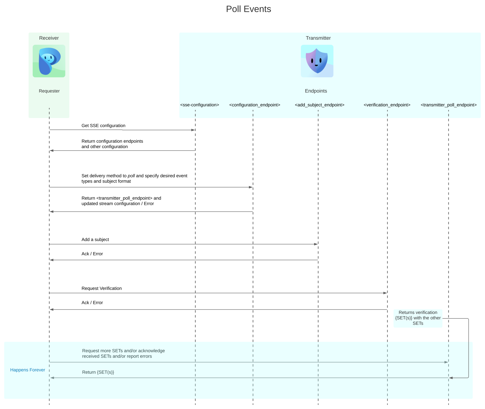
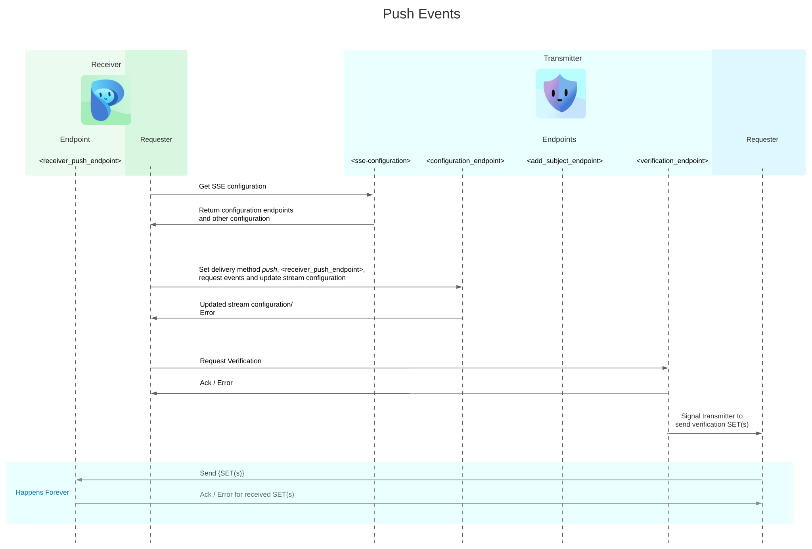

# SSF Communication Sequence
SSF (Shared Signals Framework) has two options to deliver SETs (Security Event Token), we cover them below while showing full communication sequence/flow for each of them.
We take the case of one transmitter and one receiver.
## Poll Events Delivery

In this configuration, the receiver polls for queued events from the transmitter.

In case of a `verification` request, the `<verification_endpoint>` on the transmitter acknowledges or returns an error to indicate if the contents of the request were valid.
For a valid `verification` request, the transmitter stores the `verification SET(s)` in the event queue. Later, when a valid request to `<transmitter_poll_endpoint>` is received, it returns all the `SET(s)` in the queue.

## Push Events Delivery

In this configuration, the transmitter pushes each event to the receiver without queueing them.

In case of a `verification` request, the `<verification_endpoint>` on the transmitter acknowledges or returns an error to indicate if the contents of the request were valid.
For a valid `verification` request, the transmitter `push`es the `verification SET(s)` with any other available `SET(s)` to
 `<receiver_push_endpoint>`.
