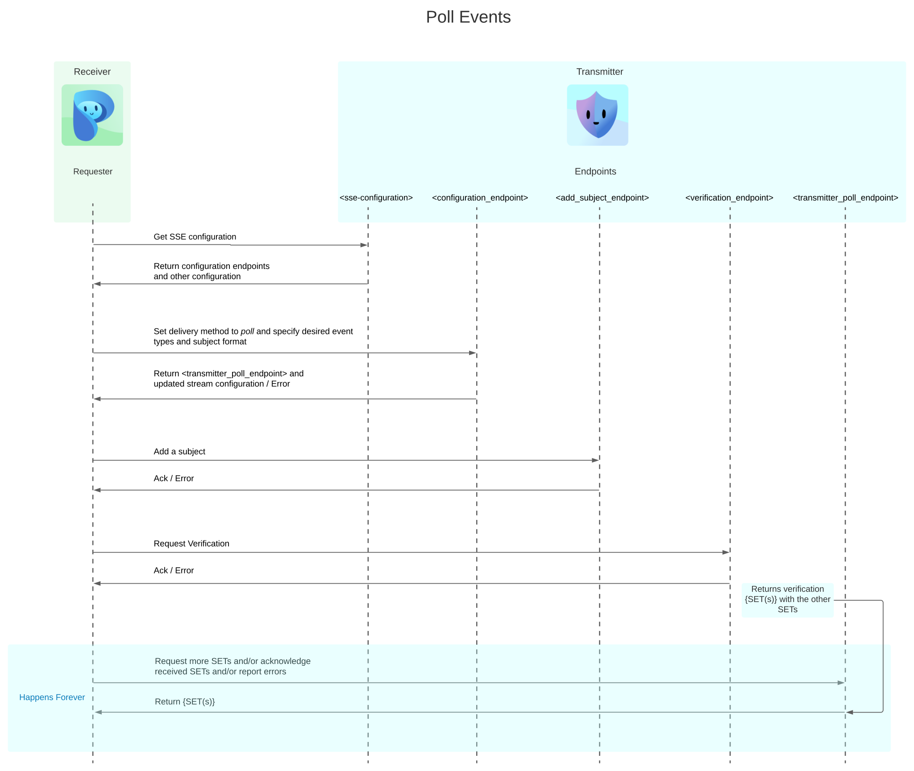
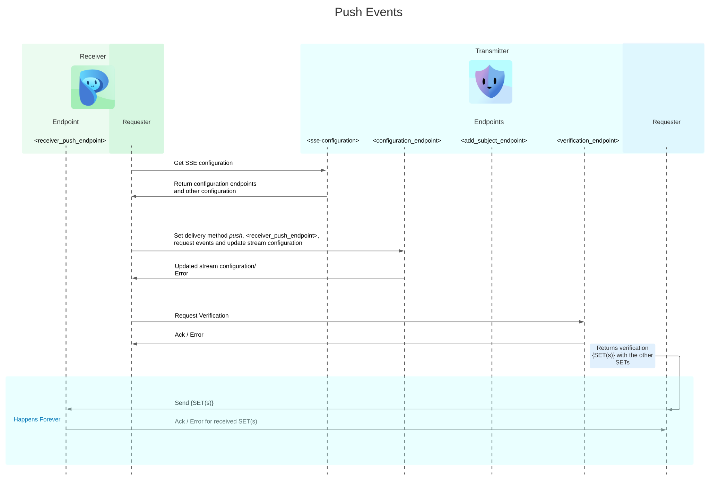

# SSE Communication Sequence
SSE (Shared Signal Events) has two options to deliver SETs (Security Event Token), we cover them below while showing full communication sequence/flow for each of them.
We take the case of one transmitter and one receiver.
## Poll Events Delivery

The transmitter has endpoints that respond to the requests sent by the receiver. And the receiver has a requester that sends requests.

In case of a `verification` request, the `<verification_endpoint>` on the transmitter, acknowledges or returns an error to indicate, if the contents of the request were valid.
For a valid `verification` request, the transmitter stores the `verification SET(s)` in the buffer(database). Later, when a valid request to `<transmitter_poll_endpoint>` is received, it returns all the `SET(s)` in the buffer.

## Push Events Delivery

The transmitter and receiver both have endpoints that respond to the requests sent to them. They (transmitter and receiver) also have requesters that are used to send request to each others endpoints.

In case of a `verification` request, the `<verification_endpoint>` on the transmitter, acknowledges or returns an error to indicate, if the contents of the request were valid.
For a valid `verification` request, the transmitter `push`es the `verification SET(s)` with any other available `SET(s)` to
 `<receiver_push_endpoint>`.